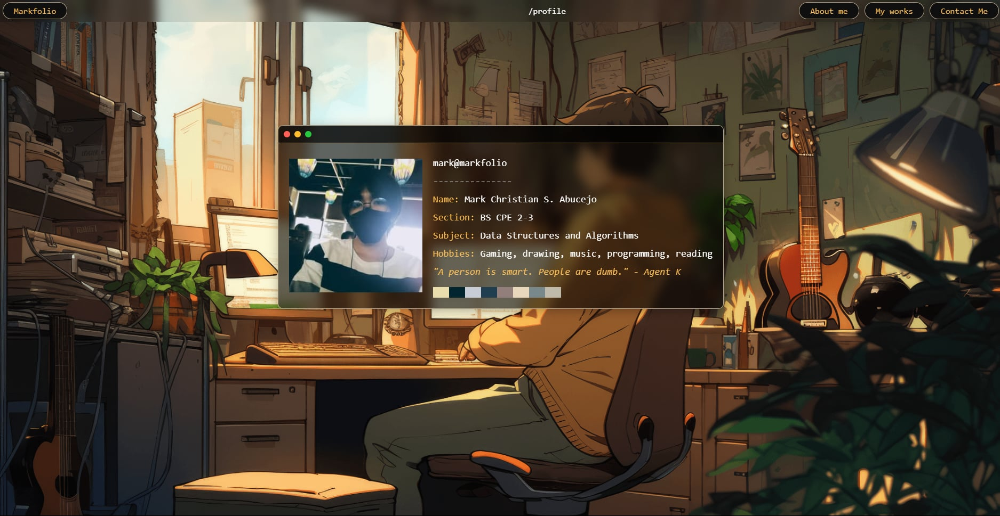

<p align="center">
  <picture>
    
  </picture>
</p>

<h1 align="center">Markforlio</h1>
<p align="center">My (Mark) personal portfolio of programming works</p>

---

## What you will see

- My profile page
- My programming works (so far)
- My available contacts online

---

## 🔭 File Structure
```bash
│
├── modules/
│   ├── __init__.py
│   └── stack.py
│
├── static/
│   ├── style.css
│   └── images/
│       ├── body_background.png
│       ├── facebook_icon.png
│       ├── github_icon.png
│       ├── phone_icon.jpg
│       ├── portfolio_image.jpg
│       ├── profile_img.jpg
│       └── website_icon.jpg
│
└── templates/
│   ├── areaofcircle.html
│   ├── areaoftriangle.html
│   ├── contact.html
│   ├── home.html
│   ├── infixtopostfixconverter.html
│   ├── main.html
│   ├── profile.html
│   ├── touppercase.html
│   └── works.html
│
├── app.py
├── test.py
├── LICENSE
├── .gitignore
├── .gitattributes
│
```

---

## 📚 Libraries Used

- Flask -> Website Framework

---

## 📦 Requirements

- Python 3.9 or newer
- Git

---

## 🧰 Setup Instructions

### 1. ✔️ Check if Python is installed and on the required version

Open Command Prompt/Terminal and run:

```bash
py --version
```
or
```bash
python --version
```
or
```bash
python3 --version
```

If python is **not installed**, download it from:  
https://www.python.org/downloads/  
Make sure to check **"Add Python to PATH"** during installation.  

### 2. 📂 Clone the GitHub repository

```bash
git clone https://github.com/nug3tsss/portfolio_website.git
cd portfolio-website
```

### 3. 🖥️ Create a Virtual Environment

```bash
py -m venv .venv
```
or
```bash
python -m venv .venv
```
or
```bash
python3 -m venv .venv
```

Activate it:
```bash
.venv\Scripts\activate
```

### 4. 📃 Install the Required Libraries

```bash
pip install flask
```

### 5. 🏃 Run the Application

```bash
python app.py
```

---

### ❗ IF THE TERMINAL COMMANDS DON'T WORK
Add the possible prefix/es:

```bash
py -m
```
or
```bash
python -m
```
or
```bash
python3 -m
```

then type the terminal command.  
For example:

```bash
py -m pip install -r requirements.txt
```
